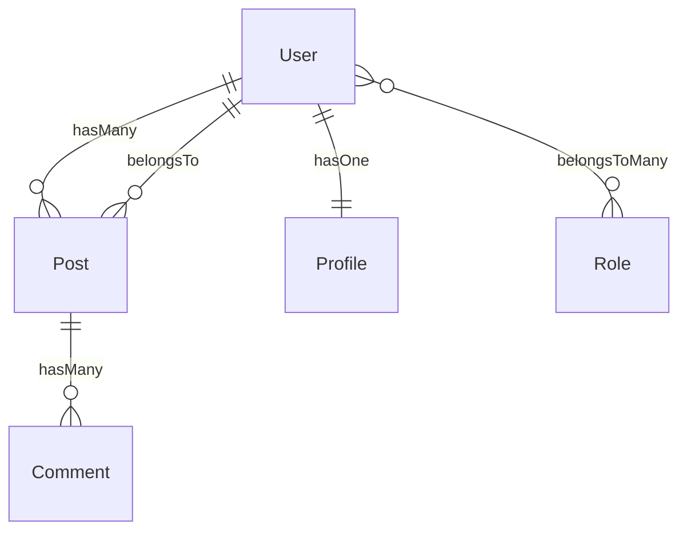

# Capyrel — Command Reference

Complete guide to every command. Written for the package owner.

---

## Table of Contents

1. [model:scaffold](#1-modelscaffold)
2. [model:map](#2-modelmap)
3. [model:resources](#3-modelresources)
4. [model:requests](#4-modelrequests)
5. [model:tests](#5-modeltests)
6. [migrate:safe](#6-migratesafe)
7. [model:watch](#7-modelwatch)
8. [capyrel:demo](#8-capyreldemo)

---

## Global Notes

Every command that reads the database accepts `--connection=` so you can point it at any configured connection in your `config/database.php`.

```bash
--connection=mysql
--connection=pgsql
--connection=sqlite
--connection=mongodb
```

If omitted, capyrel uses your app's default connection (`DB_CONNECTION` in `.env`).

Every command that writes files accepts:

```bash
--dry-run     # preview everything, write nothing
--force       # skip all confirmation prompts
```

---

## 1. `model:scaffold`

**The core command.** Reads your entire DB schema, detects every relationship, and writes code across three layers: models, controllers, and blade views.

### Signature

```bash
php artisan model:scaffold {model?} {--connection=} {--models} {--controllers} {--views} {--dry-run} {--force}
```

### Arguments

| Argument | Description |
|---|---|
| `model` | *(optional)* Scaffold only this model. e.g. `User` |

### Options

| Option | Description |
|---|---|
| `--connection=` | DB connection to use. Defaults to app default. |
| `--models` | Write to model files only — skip controllers and views |
| `--controllers` | Generate/update controllers only |
| `--views` | Add blade comments only |
| `--dry-run` | Show everything that would happen, write nothing |
| `--force` | Skip all yes/no confirmation prompts |

### How it runs

1. Connects to the database
2. Reads all tables, columns, foreign keys, and indexes
3. Detects all 8 Eloquent relationship types
4. Displays the relationship tree in the terminal
5. Runs the full health check (12 analyzers — see below)
6. Asks: write to models? generate controllers? add blade comments?
7. Writes only what you confirm

### What it writes to models

```php
// capyrel: posts.user_id
public function posts(): \Illuminate\Database\Eloquent\Relations\HasMany
{
    return $this->hasMany(Post::class);
}

// capyrel: pivot: role_user
public function roles(): \Illuminate\Database\Eloquent\Relations\BelongsToMany
{
    return $this->belongsToMany(Role::class);
}
```

It never overwrites existing methods — it only adds what is missing.

### What it writes to controllers

```php
// Injects eager loading into existing index/show methods
$users = User::with(['posts', 'profile', 'roles'])->paginate(15);

// Adds a sync method for every belongsToMany relationship
public function syncRoles(Request $request, User $user)
{
    $user->roles()->sync($request->input('roles_ids', []));
    return back()->with('success', 'Role updated.');
}
```

If no controller exists yet, capyrel generates a full resource controller and asks permission to create it.

### What it writes to blade views

```blade
{{-- ═══════════════════════════════════════════════════════
     CAPYREL  hasMany  →  Post
     detected via: posts.user_id
     ═══════════════════════════════════════════════════════ --}}
@forelse($user->posts as $post)
    {{-- $post->id --}}
    {{-- $post->name --}}
@empty
    <p>No posts.</p>
@endforelse
{{-- paginated: $user->posts()->paginate(10) --}}
```

### Health check — runs automatically on every scaffold

After showing the relationship tree, capyrel runs 12 analyzers and shows findings sorted by severity:

| Analyzer | What it catches |
|---|---|
| **N+1 query** | `$user->posts` accessed inside a `foreach` loop in a controller |
| **Missing index** | FK columns with no database index (full table scans on every eager load) |
| **Orphan FK** | `_id` columns pointing to tables that don't exist |
| **Inverse missing** | `User hasMany Post` exists but `Post belongsTo User` doesn't |
| **Naming conflict** | A generated method name matches an existing method in the model |
| **Soft-delete** | Table has `deleted_at` column but model doesn't use `SoftDeletes` trait |
| **Eager depth** | `hasManyThrough` chain is 3+ levels deep (performance risk) |
| **Circular dependency** | Self-referential model that would loop on eager-load (e.g. `Category → Category`) |
| **Cascade risk** | FK without `ON DELETE CASCADE` (orphaned rows on parent delete) |
| **Dead relationship** | Relationship method defined in model but never used in views or controllers |
| **Fillable drift** | Columns in `$fillable` that don't exist in the table (SQL only) |
| **Morph registry** | `morphTo()` used without `Relation::morphMap()` in AppServiceProvider |

Severity levels:
- `✖ error` — will cause bugs or data loss
- `⚠ warning` — risky, should be reviewed
- `ℹ info` — informational, your call

### Examples

```bash
# Interactive wizard — safest way to run
php artisan model:scaffold

# Preview everything without touching any file
php artisan model:scaffold --dry-run

# Scaffold only the Post model
php artisan model:scaffold Post

# Only inject relationships into model files, leave controllers and views alone
php artisan model:scaffold --models

# Run non-interactively (CI/CD, scripting)
php artisan model:scaffold --force

# Read from a specific DB connection
php artisan model:scaffold --connection=pgsql
```

---

## 2. `model:map`

Generates a visual diagram of all models and their relationships. Two formats: ASCII tree for the terminal, Mermaid for documentation and GitHub.

### Signature

```bash
php artisan model:map {--format=ascii} {--connection=} {--save=}
```

### Options

| Option | Default | Description |
|---|---|---|
| `--format=` | `ascii` | Output format: `ascii` \| `mermaid` \| `both` |
| `--connection=` | app default | DB connection to read from |
| `--save=` | *(none)* | Save output to a file path, e.g. `--save=docs/schema.md` |

### ASCII output

```
  ╔══════════════════════════════════════════╗
  ║    CAPYREL — MODEL RELATIONSHIP MAP      ║
  ╚══════════════════════════════════════════╝
  10 models · 18 relationships

  User
  ├── hasMany          ──▶ Post
  ├── hasOne           ──▶ Profile
  ├── belongsToMany    ──▶ Role
  └── hasManyThrough   ──▶ Comment  (via Post)

  Post
  ├── belongsTo        ──▶ User
  └── hasMany          ──▶ Comment
```

### Mermaid output

Paste directly into any GitHub markdown file or [mermaid.live](https://mermaid.live) and it renders as a diagram.



### Examples

```bash
# ASCII tree in terminal
php artisan model:map

# Mermaid diagram in terminal
php artisan model:map --format=mermaid

# Both formats
php artisan model:map --format=both

# Save mermaid diagram to a file
php artisan model:map --format=mermaid --save=docs/relationships.md

# Read from a specific connection
php artisan model:map --connection=mysql
```

### When to use it

- **Onboarding new developers** — run this first, paste the Mermaid output into your `docs/` folder
- **Architecture review** — spot models that are over-connected or isolated
- **Before a big refactor** — understand what depends on what

---

## 3. `model:resources`

Generates Laravel API Resource classes for every detected model. All relationships are wrapped in `whenLoaded()` — N+1 queries are structurally impossible from the generated code.

### Signature

```bash
php artisan model:resources {model?} {--connection=} {--force} {--dry-run}
```

### Options

| Option | Description |
|---|---|
| `model` | *(optional)* Generate for one model only |
| `--connection=` | DB connection to use |
| `--force` | Overwrite existing resource files |
| `--dry-run` | Preview file list without writing |

### What gets generated

For every model, capyrel creates `app/Http/Resources/{Model}Resource.php`:

```php
<?php

namespace App\Http\Resources;

use Illuminate\Http\Request;
use Illuminate\Http\Resources\Json\JsonResource;
use App\Http\Resources\PostResource;
use App\Http\Resources\ProfileResource;

class UserResource extends JsonResource
{
    public function toArray(Request $request): array
    {
        return [
            'id'         => $this->id,
            'name'       => $this->name,
            'email'      => $this->email,
            'created_at' => $this->created_at,
            'updated_at' => $this->updated_at,

            // capyrel: relationships — only included when eager-loaded (no N+1 possible)
            'posts'   => PostResource::collection($this->whenLoaded('posts')),
            'profile' => new ProfileResource($this->whenLoaded('profile')),
            'roles'   => RoleResource::collection($this->whenLoaded('roles')),
        ];
    }
}
```

Using the resource in a controller:

```php
// Data only — no relationships
return new UserResource($user);

// With relationships — load them first
$user->load(['posts', 'profile', 'roles']);
return new UserResource($user);
```

### Examples

```bash
# Generate resources for all detected models
php artisan model:resources

# Generate only for User
php artisan model:resources User

# Preview what would be created
php artisan model:resources --dry-run

# Overwrite files that already exist
php artisan model:resources --force
```

---

## 4. `model:requests`

Generates `Store` and `Update` Form Request classes with validation rules derived from your actual column types, sizes, constraints, and naming conventions.

### Signature

```bash
php artisan model:requests {model?} {--connection=} {--force} {--dry-run}
```

### Options

| Option | Description |
|---|---|
| `model` | *(optional)* Generate for one model only |
| `--connection=` | DB connection to use |
| `--force` | Overwrite existing request files |
| `--dry-run` | Preview without writing |

### How validation rules are generated

| Column definition | Generated rule |
|---|---|
| `NOT NULL` column | `'required'` |
| `nullable` column | `'nullable'` |
| `varchar(255)` | `'string', 'max:255'` |
| `text` | `'string'` |
| `integer` / `bigint` | `'integer'` |
| `boolean` / `tinyint(1)` | `'boolean'` |
| `decimal` / `float` | `'numeric'` |
| `date` / `datetime` | `'date'` |
| `json` | `'array'` |
| FK column (`*_id`) | `'integer', 'exists:table,id'` |
| Unique index column | `Rule::unique('table', 'column')` |
| Column named `email` | adds `'email'` |
| Column named `*_url`, `website` | adds `'url'` |
| Column named `password` | `'string', 'min:8', 'confirmed'` |

**Store request** uses `'required'` on non-nullable columns.
**Update request** uses `'sometimes'` on all columns (partial updates safe).

### What gets generated

`app/Http/Requests/StorePostRequest.php`:

```php
public function rules(): array
{
    return [
        'title'      => ['required', 'string', 'max:255'],
        'body'       => ['required', 'string'],
        'user_id'    => ['required', 'integer', 'exists:users,id'],
        'slug'       => ['required', 'string', Rule::unique('posts', 'slug')],
        'visible_at' => ['nullable', 'date'],
    ];
}
```

`app/Http/Requests/UpdatePostRequest.php`:

```php
public function rules(): array
{
    return [
        'title'      => ['sometimes', 'string', 'max:255'],
        'body'       => ['sometimes', 'string'],
        'user_id'    => ['sometimes', 'integer', 'exists:users,id'],
        'slug'       => ['sometimes', 'string', Rule::unique('posts', 'slug')],
        'visible_at' => ['sometimes', 'nullable', 'date'],
    ];
}
```

### Examples

```bash
# Generate Store + Update requests for all tables
php artisan model:requests

# One model only
php artisan model:requests Post

# Preview the rule lists without writing
php artisan model:requests --dry-run

# Overwrite existing
php artisan model:requests --force
```

---

## 5. `model:tests`

Generates Pest test files for every detected relationship. Two kinds of tests per file: fast type assertions (no DB needed) and factory integration tests (skipped by default, remove the skip to enable).

### Signature

```bash
php artisan model:tests {model?} {--connection=} {--force} {--dry-run}
```

### Options

| Option | Description |
|---|---|
| `model` | *(optional)* Generate for one model only |
| `--connection=` | DB connection to use |
| `--force` | Overwrite existing test files |
| `--dry-run` | Preview test names without writing |

### What gets generated

`tests/Models/UserTest.php`:

```php
<?php

use App\Models\User;
use App\Models\Post;
use App\Models\Role;
use Illuminate\Database\Eloquent\Relations\HasMany;
use Illuminate\Database\Eloquent\Relations\HasOne;
use Illuminate\Database\Eloquent\Relations\BelongsToMany;

describe('User relationships', function () {

    // ── Relationship type assertions (no DB needed) ──────────────────────

    it('User::posts() returns a HasMany', function () {
        expect((new User)->posts())->toBeInstanceOf(HasMany::class);
    });

    it('User::profile() returns a HasOne', function () {
        expect((new User)->profile())->toBeInstanceOf(HasOne::class);
    });

    it('User::roles() returns a BelongsToMany', function () {
        expect((new User)->roles())->toBeInstanceOf(BelongsToMany::class);
    });

    // ── Integration tests (require DB + factories) ────────────────────────

    it('User hasMany Post relationship works', function () {
        $model = User::factory()->create();
        $child = Post::factory()->create(['user_id' => $model->id]);
        expect($model->fresh()->posts)->toHaveCount(1);
    })->skip('Requires factory and DB — remove skip() to enable');

    it('User can attach Role', function () {
        $model = User::factory()->create();
        $role  = Role::factory()->create();
        $model->roles()->attach($role->id);
        expect($model->fresh()->roles)->toHaveCount(1);
    })->skip('Requires factory and DB — remove skip() to enable');
});
```

### Running the generated tests

```bash
# Run all relationship tests
php artisan test --filter=relationships

# Run tests for a specific model
php artisan test --filter="User relationships"

# Run only the type assertion tests (fast, no DB)
php artisan test tests/Models/UserTest.php
```

### Examples

```bash
# Generate test files for all models
php artisan model:tests

# One model only
php artisan model:tests User

# Preview test names without writing any files
php artisan model:tests --dry-run

# Overwrite existing test files
php artisan model:tests --force
```

---

## 6. `migrate:safe`

Scans your **pending** migrations for dangerous patterns before running them. Shows errors and warnings, then asks confirmation. Wraps `php artisan migrate` — same behavior, just with the safety scan first.

### Signature

```bash
php artisan migrate:safe {--check} {--force} {--database=} {--path=}
```

### Options

| Option | Description |
|---|---|
| `--check` | Scan only — never runs migrations, just reports |
| `--force` | Skip confirmation and run even if issues found |
| `--database=` | DB connection to use |
| `--path=` | Migration path (same as artisan migrate --path) |

### Dangerous patterns it detects

| Pattern | Severity | Why it's dangerous |
|---|---|---|
| `Schema::drop()` | **error** | Entire table deleted — cannot be undone |
| `Schema::dropIfExists()` | **error** | Same risk as drop |
| `TRUNCATE` in migration | **error** | Cannot be rolled back in many databases |
| NOT NULL column without `->default()` | **error** | Fails immediately on non-empty tables |
| `->dropColumn()` | **warning** | Permanent data loss for that column |
| `->unique()` on existing table | **warning** | Fails if duplicate values already exist |
| `->change()` on column type | **warning** | Can silently truncate data if type is narrowed |
| `->renameColumn()` | **warning** | Any code using the old name breaks instantly |
| `Schema::rename()` | **warning** | Same risk — all references break |
| `->foreign()` without index | **info** | Unindexed FK causes full table scans |
| Narrowing `bigInteger` → `integer` | **warning** | Values above 2.1 billion will be corrupted |

### Example terminal output

```
  Scanning 2 pending migration(s) for safety issues...

  2026_05_14_add_status_to_orders

  ✖ add_status_to_orders: Adding NOT NULL column 'status' to existing table without a default
    ↳ Add ->default('pending') or ->nullable() — otherwise this migration FAILS on non-empty tables

  2026_05_14_drop_old_logs_table

  ✖ drop_old_logs_table: Schema::drop('logs') — entire table will be deleted
    ↳ Verify no active code references 'logs'. Run on staging first. Ensure backups exist.

  2 critical issue(s) found.
  These migrations could cause data loss or failure. Run anyway? [yes/no]
```

### Examples

```bash
# Scan + ask confirmation + run
php artisan migrate:safe

# Scan only — never touches the database
php artisan migrate:safe --check

# Scan + run without asking (CI/CD pipelines)
php artisan migrate:safe --force

# Scan against a specific connection
php artisan migrate:safe --check --database=mysql

# Scan a specific migration path
php artisan migrate:safe --path=database/migrations/tenant
```

---

## 7. `model:watch`

Watches `database/migrations/` in the background. When a migration file is created or modified, capyrel re-runs relationship detection and automatically injects any new relationship methods into your model files.

This is the **zero-effort** way to keep your models in sync while you're actively building features.

### Signature

```bash
php artisan model:watch {--connection=} {--interval=2}
```

### Options

| Option | Default | Description |
|---|---|---|
| `--connection=` | app default | DB connection to read from |
| `--interval=` | `2` | How often to check for changes (seconds) |

### How it works

1. Analyzes the current schema on startup
2. Records modification times of all migration files
3. Every N seconds, checks for new or modified files
4. If something changed: re-analyzes the schema, diffs the new relationships against the old ones
5. Injects only **new** methods — never duplicates or overwrites existing code
6. Prints exactly what changed in the terminal with timestamps

### Example terminal output

```
  Capyrel Watch Mode
  Watching database/migrations/
  Polling every 2s · Press Ctrl+C to stop

  ✔ Initial scan complete — 18 relationships detected

  [14:32:11] New migration: 2026_05_13_143211_add_team_id_to_posts.php
  ✔ Post: 1 new relationship(s) injected
    + belongsTo(Team) via posts.team_id

  [14:38:44] Modified: 2026_05_13_143800_create_tags_table.php
  ✔ Post: 1 new relationship(s) injected
    + belongsToMany(Tag) via post_tag pivot
  ✔ Tag: 1 new relationship(s) injected
    + belongsToMany(Post) via post_tag pivot
```

### Examples

```bash
# Start watching with default 2s interval
php artisan model:watch

# Watch a specific DB connection
php artisan model:watch --connection=mysql

# Check every 5 seconds (lighter on resources for large apps)
php artisan model:watch --interval=5
```

### Notes

- Runs until you press `Ctrl+C`
- Only injects relationships that don't already exist in the model
- If a model file doesn't exist, it logs a warning and skips that model
- On Windows, uses polling (not native FS events) — `--interval` controls polling speed
- Does not run the health check on each change — just injects code

---

## 8. `capyrel:demo`

Creates a temporary SQLite demo database, seeds it with example tables (users, profiles, roles, posts, comments, likes), runs `model:scaffold --dry-run`, and cleans up. Use this to see exactly what capyrel detects and outputs before running it on your real project.

### Signature

```bash
php artisan capyrel:demo
```

### No options — fully automated.

### What the demo sets up

```
users      (id, name, email)
profiles   (id, user_id UNIQUE → hasOne from User)
roles      (id, name)
role_user  (user_id, role_id → belongsToMany pivot)
posts      (id, user_id, title, body)
comments   (id, post_id, commentable_type, commentable_id, body)
likes      (id, user_id, likeable_type, likeable_id)
```

### What it demonstrates

- `hasOne` detection (profiles.user_id with unique index)
- `hasMany` detection (posts.user_id, comments.post_id)
- `belongsToMany` detection (role_user pivot)
- `morphTo` detection (comments.commentable_type + commentable_id)
- `hasManyThrough` detection (User → Post → Comment chain)
- Full health check output with warnings

### When to use it

- First time using capyrel — run this to understand the output format
- Before running on a real project — confirm it behaves as expected
- Demonstrating capyrel to teammates

```bash
php artisan capyrel:demo
```

---

## Quick reference

```bash
# See all capyrel commands in one place
php artisan list | grep -E "model:|migrate:safe|capyrel"

# Get help for any specific command
php artisan help model:scaffold
php artisan help model:map
php artisan help model:resources
php artisan help model:requests
php artisan help model:tests
php artisan help migrate:safe
php artisan help model:watch
php artisan help capyrel:demo
```

---

## Recommended workflow for a new project

```bash
# 1. Run a dry-run first — see everything before committing
php artisan model:scaffold --dry-run

# 2. Look at the map to understand your schema
php artisan model:map --format=both

# 3. Check migrations are safe before running them
php artisan migrate:safe --check

# 4. Run full scaffold
php artisan model:scaffold

# 5. Generate the API layer
php artisan model:resources
php artisan model:requests

# 6. Generate tests
php artisan model:tests

# 7. Start watch mode while you continue building
php artisan model:watch
```

---

## Recommended workflow for an existing project

```bash
# 1. Preview only — zero risk
php artisan model:scaffold --dry-run

# 2. Start with just models (safest layer)
php artisan model:scaffold --models

# 3. Review what was added, then generate the rest
php artisan model:scaffold --controllers
php artisan model:scaffold --views

# 4. Generate tests to verify relationships are correct
php artisan model:tests

# 5. Save the map to your docs
php artisan model:map --format=mermaid --save=docs/schema.md
```
