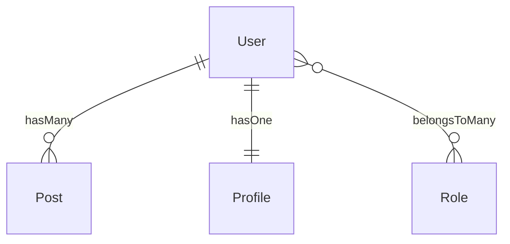

# Capyrel — Command Reference

Complete guide to every command. Written for the package owner.

**Current version: v1.6.0**

---

## Table of Contents

1. [model:scaffold](#1-modelscaffold)
2. [model:map](#2-modelmap)
3. [model:resources](#3-modelresources)
4. [model:requests](#4-modelrequests)
5. [model:tests](#5-modeltests)
6. [model:factory](#6-modelfactory)
7. [model:policy](#7-modelpolicy)
8. [model:seed](#8-modelseed)
9. [model:optimize](#9-modeloptimize)
10. [model:livewire](#10-modellivewire)
11. [model:enum](#11-modelenum)
12. [model:events](#12-modelevents)
13. [migrate:safe](#13-migratesafe)
14. [model:watch](#14-modelwatch)
15. [capyrel:fullstack](#15-capyrelfullstack)
16. [capyrel:audit](#16-capyrelaudit)
17. [capyrel:clean](#17-capyrelclean)
18. [capyrel:demo](#18-capyreldemo)
19. [capyrel:install-extension](#19-capyrelinstall-extension)

---

## Global flags (every command)

```bash
--connection=mysql    # use a specific DB connection
--connection=pgsql
--connection=sqlite
--connection=mongodb

--dry-run             # preview everything, write nothing
--force               # skip all yes/no prompts
```

---

## 1. `model:scaffold`

Reads your DB schema, detects all 8 Eloquent relationship types, and writes models, controllers, blade pages, and routes.

```bash
php artisan model:scaffold                     # interactive wizard
php artisan model:scaffold User                # one model only
php artisan model:scaffold --dry-run           # preview without writing
php artisan model:scaffold --models            # models only
php artisan model:scaffold --controllers       # controllers only
php artisan model:scaffold --views             # blade pages only
php artisan model:scaffold --routes            # routes/web.php only
php artisan model:scaffold --force             # skip all prompts
php artisan model:scaffold --connection=pgsql  # specific DB
```

**What each model gets:**
- Relationship methods injected (`hasMany`, `belongsTo`, `belongsToMany`, etc.)
- Controller with inline `$request->validate([...])` rules (no `validated()` crash)
- Eager loading on `index()` and `show()` — N+1 prevented automatically

**What the blade index page contains (v1.6.0 modal-first):**

| Element | Behaviour |
|---|---|
| **New button** | Opens right-side offcanvas with create form — no page load |
| **Row hover** | View / Edit / Delete icons appear |
| **View icon** | Opens quick-view slide-over populated from JSON — zero server round-trip |
| **Edit icon** | Navigates to dedicated edit page |
| **Delete icon** | Opens confirmation modal with item name |
| **Search bar** | Live client-side filter — no server request |
| **Form submit** | Button disables + spinner + "Creating…" text |
| **Toast** | Auto-dismissing success notification |

**Standalone vs dependent models:**

Capyrel detects whether a model is standalone (`User`, `Post`) or dependent (`Comment`, `Attachment`, `OrderItem`). Dependent models get nested routes and inline forms on the parent's show page — never a `/comments/create` page.

**Health check — runs on every scaffold:**

12 analyzers fire automatically: N+1 risk, missing indexes, orphan FKs, inverse missing, naming conflicts, soft-delete, eager depth, circular deps, cascade risk, dead relationships, fillable drift, morph registry.

---

## 2. `model:map`

Visual diagram of every model and relationship.

```bash
php artisan model:map                                 # ASCII tree
php artisan model:map --format=mermaid                # Mermaid.js for GitHub
php artisan model:map --format=both
php artisan model:map --save=docs/schema.md           # save to file
php artisan model:map --connection=mysql
```

Mermaid output — paste into any GitHub markdown:



---

## 3. `model:resources`

Generates API Resource classes. All relationships use `whenLoaded()` — N+1 structurally impossible.

```bash
php artisan model:resources
php artisan model:resources User
php artisan model:resources --dry-run
php artisan model:resources --force
```

Generated `UserResource::toArray()` includes:
```php
'posts'   => PostResource::collection($this->whenLoaded('posts')),
'profile' => new ProfileResource($this->whenLoaded('profile')),
```

---

## 4. `model:requests`

Generates `Store` and `Update` Form Request classes from actual column types and constraints.

```bash
php artisan model:requests
php artisan model:requests Post
php artisan model:requests --dry-run
php artisan model:requests --force
```

**Column → rule mapping:**

| Column | Rule |
|---|---|
| `NOT NULL` varchar | `required, string, max:255` |
| `nullable` | `nullable` instead of `required` |
| `*_id` FK column | `integer, exists:table,id` |
| unique index | `Rule::unique('table')` |
| named `email` | adds `email` |
| named `password` | `string, min:8, confirmed` |
| `datetime` | `date` |
| `json` | `array` |

**Update requests** use `sometimes` instead of `required` (safe for partial updates).

---

## 5. `model:tests`

Generates Pest test files for every detected relationship.

```bash
php artisan model:tests
php artisan model:tests User
php artisan model:tests --dry-run
php artisan model:tests --force
```

Each file contains:
- **Type assertion tests** — `expect((new User)->posts())->toBeInstanceOf(HasMany::class)` — no DB needed
- **Integration tests** — factory-based, skipped by default — remove `->skip()` to enable

Run: `php artisan test --filter=relationships`

---

## 6. `model:factory`

Generates Eloquent factories with smart Faker values derived from column names and types.

```bash
php artisan model:factory
php artisan model:factory User
php artisan model:factory --dry-run
php artisan model:factory --force
```

**60+ smart mappings:**

| Column name | Generated Faker |
|---|---|
| `email` | `fake()->unique()->safeEmail()` |
| `name` | `fake()->name()` |
| `password` | `bcrypt('password')` |
| `price`, `amount` | `fake()->randomFloat(2, 1, 999)` |
| `status` | `fake()->randomElement(['active', 'inactive', 'pending'])` |
| `slug` | `fake()->unique()->slug()` |
| `*_id` FK | `RelatedModel::factory()` |
| `body`, `content` | `fake()->paragraphs(2, true)` |
| `lat`, `lng` | `fake()->latitude()` / `fake()->longitude()` |

**Auto-generated states:** `->deleted()`, `->unverified()`, `->active()`, `->published()`

---

## 7. `model:policy`

Generates Laravel Policies detecting ownership columns automatically.

```bash
php artisan model:policy
php artisan model:policy Post
php artisan model:policy --dry-run
php artisan model:policy --force
```

Detects owner columns: `user_id`, `author_id`, `owner_id`, `created_by`

Generated `update()` / `delete()`:
```php
public function update(User $user, Post $post): bool
{
    return $post->user_id === $user->id;
}
```

Register after generation:
```php
Gate::policy(Post::class, PostPolicy::class);
```

---

## 8. `model:seed`

Generates seeders in **topological FK order** — parents always seeded before children.

```bash
php artisan model:seed
php artisan model:seed User
php artisan model:seed --count=20      # 20 records per model
php artisan model:seed --dry-run
php artisan model:seed --force
php artisan model:seed --no-database   # skip updating DatabaseSeeder
```

- Builds a dependency graph from `belongsTo` relationships
- Sorts models so `User` is seeded before `Post` (posts need users)
- Rewrites `DatabaseSeeder.php` with the correct call order

Run: `php artisan db:seed`

---

## 9. `model:optimize`

Adds missing properties and methods to existing model files.

```bash
php artisan model:optimize
php artisan model:optimize User
php artisan model:optimize --dry-run
php artisan model:optimize --force
```

**What it adds:**

| Addition | Condition |
|---|---|
| `$fillable` | Missing from model |
| `$casts` | datetime/boolean/json columns present |
| `$hidden` | password/token columns present |
| `scopeActive()` | `status` column exists |
| `scopePublished()` | `published_at` column exists |
| `scopeSearch($term)` | title/name/body/email columns exist |
| `getFullNameAttribute()` | `first_name` + `last_name` both exist |

---

## 10. `model:livewire`

Generates Livewire components: a searchable/sortable table and a live-validated form.

```bash
php artisan model:livewire
php artisan model:livewire User
php artisan model:livewire --dry-run
php artisan model:livewire --force
```

Installs Livewire automatically if not present.

**Generated files per model:**

| File | What it does |
|---|---|
| `app/Livewire/UserTable.php` | Searchable, sortable, paginated — `wire:model.live` search |
| `resources/views/livewire/user-table.blade.php` | Table with `wire:click` delete + `wire:confirm` |
| `app/Livewire/UserForm.php` | Create/edit with live validation, fires `user-saved` event |
| `resources/views/livewire/user-form.blade.php` | Real-time form fields |

Usage in blade:
```blade
<livewire:user-table />
<livewire:user-form />
```

---

## 11. `model:enum`

Generates PHP 8.1 backed Enum classes for `status`, `type`, `role`, `priority` columns.

```bash
php artisan model:enum
php artisan model:enum Post
php artisan model:enum --dry-run
php artisan model:enum --force
```

Generated `PostStatus` enum includes:
```php
enum PostStatus: string
{
    case Active   = 'active';
    case Inactive = 'inactive';
    case Pending  = 'pending';

    public function label(): string { ... }   // "Active", "Inactive"
    public function color(): string { ... }   // "green", "gray", "yellow"
    public function badge(): string { ... }   // "badge bg-success"
    public static function options(): array { ... }  // for select dropdowns
}
```

Add to your model:
```php
protected $casts = ['status' => PostStatus::class];
```

---

## 12. `model:events`

Generates Event classes and Observer stubs for every model.

```bash
php artisan model:events
php artisan model:events Post
php artisan model:events --dry-run
php artisan model:events --force
```

**Generated files per model:**

| File | |
|---|---|
| `app/Events/PostCreated.php` | Dispatchable, SerializesModels |
| `app/Events/PostUpdated.php` | |
| `app/Events/PostDeleted.php` | |
| `app/Observers/PostObserver.php` | created/updated/deleted/restored stubs |
| `capyrel-observer-registrations.php` | Copy into `AppServiceProvider::boot()` |

---

## 13. `migrate:safe`

Scans pending migrations for dangerous patterns before running them.

```bash
php artisan migrate:safe           # scan + confirm + run
php artisan migrate:safe --check   # scan only, never runs
php artisan migrate:safe --force   # run without confirmation
php artisan migrate:safe --check --database=mysql
```

**Patterns detected:**

| Pattern | Severity |
|---|---|
| `Schema::drop()` / `Schema::dropIfExists()` | error |
| `TRUNCATE` inside migration | error |
| NOT NULL column without `->default()` on existing table | error |
| `->dropColumn()` | warning |
| `->unique()` on existing table | warning |
| `->change()` column type | warning |
| `->renameColumn()` / `Schema::rename()` | warning |
| Manual FK without index | info |

---

## 14. `model:watch`

Watches `database/migrations/` and auto-injects new relationship methods when you add a migration.

```bash
php artisan model:watch
php artisan model:watch --connection=mysql
php artisan model:watch --interval=5    # check every 5 seconds
```

Press `Ctrl+C` to stop. Shows exactly which method was injected and from which migration.

---

## 15. `capyrel:fullstack`

Runs all 12 scaffold steps in the correct order in one command.

```bash
php artisan capyrel:fullstack
php artisan capyrel:fullstack --dry-run
php artisan capyrel:fullstack --force
php artisan capyrel:fullstack --skip=livewire,events    # skip specific steps
php artisan capyrel:fullstack --connection=pgsql
```

**Step order:**

```
1.  model:scaffold    → models, controllers, blade, routes
2.  model:resources   → API resources
3.  model:requests    → form requests
4.  model:factory     → Faker factories
5.  model:policy      → authorization policies
6.  model:seed        → seeders in FK-safe order
7.  model:optimize    → fillable, casts, scopes, search
8.  model:enum        → PHP 8.1 enums
9.  model:events      → events + observers
10. model:tests       → Pest relationship tests
11. model:livewire    → Livewire components (if installed)
12. capyrel:audit     → full health report
```

---

## 16. `capyrel:audit`

Generates a complete health report of your schema and relationships.

```bash
php artisan capyrel:audit                        # saves CAPYREL_AUDIT.md
php artisan capyrel:audit --output=docs/audit.md # custom path
php artisan capyrel:audit --json                 # JSON output
php artisan capyrel:audit --ci                   # exit non-zero if errors (CI/CD)
```

Report contains: summary table, all 12 health check findings, full relationship map, recommended next steps. Use `--ci` in GitHub Actions to block merges when schema errors exist.

---

## 17. `capyrel:clean`

Removes all capyrel-generated code from your project.

```bash
php artisan capyrel:clean              # interactive — asks before each layer
php artisan capyrel:clean --dry-run    # show what would be removed
php artisan capyrel:clean --force      # remove everything without prompts
php artisan capyrel:clean --models     # remove injected model methods only
php artisan capyrel:clean --controllers
php artisan capyrel:clean --views
php artisan capyrel:clean --routes
```

**Run this BEFORE `composer remove julio/capyrel`** — once the package is removed the command no longer exists.

Full removal:
```bash
php artisan capyrel:clean --force
composer remove julio/capyrel
```

---

## 18. `capyrel:demo`

Creates a temporary SQLite database, seeds it with example tables, runs `model:scaffold --dry-run`, and cleans up. Use before running capyrel on your real project.

```bash
php artisan capyrel:demo
```

No options. Fully automated.

---

## 19. `capyrel:install-extension`

Installs the Capyrel VS Code extension into your editor.

```bash
php artisan capyrel:install-extension
```

The pre-built `.vsix` ships inside the package — no npm or Node.js required.

If VS Code CLI is not in your PATH (common on Windows):
1. Open VS Code
2. `Ctrl+Shift+P` → **"Shell Command: Install 'code' command in PATH"**
3. Reopen terminal
4. Run `php artisan capyrel:install-extension` again

**Extension features:**
- Command Palette (`Ctrl+Shift+P` → type "Capyrel") — all 19 commands accessible
- **Capyrel Relationships** panel in Explorer sidebar — live tree of all models, auto-refreshes on migration changes
- PHP snippets: `cap:hasmany`, `cap:belongsto`, `cap:btm`, `cap:hmt`, `cap:morphto`, `cap:resource`, `cap:rules`
- Blade snippets: `cap:forelse`, `cap:bsinput`, `cap:twinput`, `cap:delete`, `cap:sync`

---

## Quick reference

```bash
php artisan list | grep -E "model:|migrate:safe|capyrel"
php artisan help model:scaffold
```

---

## Recommended workflow — new project

```bash
php artisan migrate                 # run your migrations first
php artisan capyrel:fullstack       # does everything in one command
```

## Recommended workflow — existing project

```bash
php artisan model:scaffold --dry-run    # preview
php artisan model:scaffold --models     # start with models only
php artisan model:scaffold --controllers
php artisan model:scaffold --views
php artisan model:scaffold --routes
php artisan model:factory
php artisan model:policy
php artisan model:tests
php artisan model:map --format=mermaid --save=docs/schema.md
php artisan capyrel:audit
```

## Removing capyrel

```bash
php artisan capyrel:clean --force   # remove generated code first
composer remove julio/capyrel       # then remove the package
```
one command and do all
php artisan capyrel:fullstack

The right way — one command
After composer require julio/capyrel:


php artisan capyrel:install-extension

composer update julio/capyrel