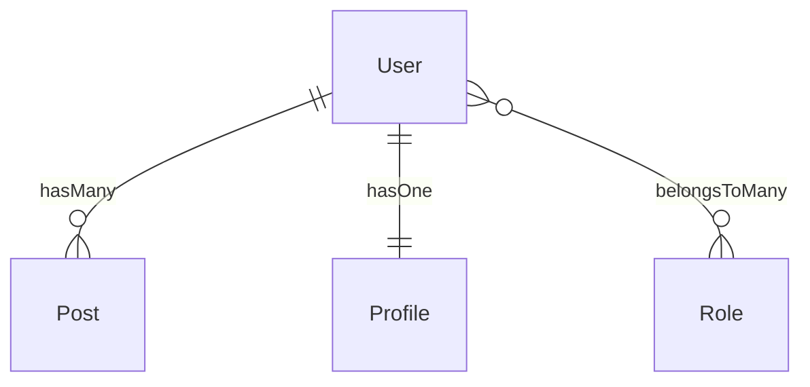

# Capyrel — Command Reference

Complete guide to every command. Written for the package owner.

**Current version: v1.1.0**

---

## Table of Contents

1. [model:scaffold](#1-modelscaffold)
2. [model:map](#2-modelmap)
3. [model:resources](#3-modelresources)
4. [model:requests](#4-modelrequests)
5. [model:tests](#5-modeltests)
6. [migrate:safe](#6-migratesafe)
7. [model:watch](#7-modelwatch)
8. [capyrel:demo](#8-capyreldemo)
9. [VS Code Extension](#9-vs-code-extension)

---

## Global Notes

Every command that reads the database accepts `--connection=` so you can point it at any configured connection in your `config/database.php`.

```bash
--connection=mysql
--connection=pgsql
--connection=sqlite
--connection=mongodb
```

If omitted, capyrel uses your app's default connection (`DB_CONNECTION` in `.env`).

Every command that writes files accepts:

```bash
--dry-run     # preview everything, write nothing
--force       # skip all confirmation prompts
```

---

## 1. `model:scaffold`

**The core command.** Reads your entire DB schema, detects every relationship, and writes code across four layers: models, controllers, blade views, and routes.

### Signature

```bash
php artisan model:scaffold {model?} {--connection=} {--models} {--controllers} {--views} {--routes} {--dry-run} {--force}
```

### Arguments

| Argument | Description |
|---|---|
| `model` | *(optional)* Scaffold only this model. e.g. `User` |

### Options

| Option | Description |
|---|---|
| `--connection=` | DB connection to use. Defaults to app default. |
| `--models` | Write relationship methods to model files only |
| `--controllers` | Generate/update controllers only |
| `--views` | Generate full blade pages (index, show, create, edit) |
| `--routes` | Write resource routes to routes/web.php |
| `--dry-run` | Show everything that would happen, write nothing |
| `--force` | Skip all yes/no confirmation prompts |

### How it runs

1. Connects to the database and reads the schema
2. Detects all 8 Eloquent relationship types
3. Detects your CSS framework (Bootstrap / Tailwind / plain)
4. Displays the relationship tree in the terminal
5. Runs the full health check (12 analyzers)
6. Asks: write models? generate controllers? generate blade pages? write routes?
7. Writes only what you confirm

### What it writes to models

```php
// capyrel: posts.user_id
public function posts(): \Illuminate\Database\Eloquent\Relations\HasMany
{
    return $this->hasMany(Post::class);
}

// capyrel: pivot: role_user
public function roles(): \Illuminate\Database\Eloquent\Relations\BelongsToMany
{
    return $this->belongsToMany(Role::class);
}
```

It never overwrites existing methods — only adds what is missing.

### What it writes to controllers

```php
// Injects eager loading into existing index/show methods
$users = User::with(['posts', 'profile', 'roles'])->paginate(15);

// Generates a sync method for every belongsToMany relationship
public function syncRoles(Request $request, User $user)
{
    $user->roles()->sync($request->input('roles_ids', []));
    return back()->with('success', 'Role updated.');
}
```

### What it generates for blade views *(v1.1.0)*

Generates **4 fully working pages** per model, styled for your detected CSS framework:

| Page | What's inside |
|---|---|
| `index.blade.php` | Table with columns, pagination, create button, delete confirm |
| `show.blade.php` | All fields in a detail card + relationship sections |
| `create.blade.php` | Full form with correct input types, validation error messages |
| `edit.blade.php` | Same form pre-filled with existing model values |

**Bootstrap detected:**
```blade
<div class="card shadow-sm">
    <div class="card-body">
        <div class="mb-3">
            <label class="form-label">Title</label>
            <input type="text" name="title" class="form-control @error('title') is-invalid @enderror">
            @error('title') <div class="invalid-feedback">{{ $message }}</div> @enderror
        </div>
    </div>
</div>
```

**Tailwind detected:**
```blade
<div class="bg-white overflow-hidden shadow-sm sm:rounded-lg">
    <div class="p-6">
        <div>
            <label class="block text-sm font-medium text-gray-700">Title</label>
            <input type="text" name="title" class="mt-1 block w-full rounded-md border-gray-300 @error('title') border-red-500 @enderror">
            @error('title') <p class="mt-1 text-sm text-red-600">{{ $message }}</p> @enderror
        </div>
    </div>
</div>
```

Framework is auto-detected from `package.json`, `composer.json`, and CSS files — no config needed.

### What it writes to routes *(v1.1.0)*

Appends resource routes to `routes/web.php`:

```php
// capyrel: generated resource routes
Route::middleware(['auth'])->group(function () {
    Route::resource('users', App\Http\Controllers\UserController::class);
    Route::resource('posts', App\Http\Controllers\PostController::class);
});
```

**Oxalis detection:** if `julio/oxalis` is found in `composer.json`, capyrel uses it directly. If not, it asks in the terminal:

```
No authentication package detected.
Install Oxalis (passkey-first auth for Laravel)? [yes/no]
```
- **Yes** → runs `composer require julio/oxalis:@dev` then writes routes
- **No** → writes routes with standard `auth` middleware

### Health check — runs automatically on every scaffold

After showing the relationship tree, capyrel runs 12 analyzers:

| Analyzer | What it catches |
|---|---|
| **N+1 query** | Relationship access inside `foreach` loops in controllers |
| **Missing index** | FK columns with no index (full table scans on every eager load) |
| **Orphan FK** | `_id` columns referencing tables that don't exist |
| **Inverse missing** | `User hasMany Post` exists but `Post belongsTo User` doesn't |
| **Naming conflict** | Generated method name matches an existing model method |
| **Soft-delete** | Table has `deleted_at` but model doesn't use `SoftDeletes` trait |
| **Eager depth** | `hasManyThrough` chain is 3+ levels deep |
| **Circular dependency** | Self-referential model that would loop on eager-load |
| **Cascade risk** | FK without `ON DELETE CASCADE` (orphaned rows on parent delete) |
| **Dead relationship** | Relationship method defined but never used anywhere |
| **Fillable drift** | Columns in `$fillable` that don't exist in the table (SQL only) |
| **Morph registry** | `morphTo()` used without `Relation::morphMap()` |

Severity levels:
- `✖ error` — will cause bugs or data loss
- `⚠ warning` — risky, should be reviewed
- `ℹ info` — informational, your call

### Examples

```bash
# Interactive wizard — safest way to run
php artisan model:scaffold

# Preview everything without touching any file
php artisan model:scaffold --dry-run

# Scaffold only the Post model
php artisan model:scaffold Post

# Only inject relationships into model files
php artisan model:scaffold --models

# Only generate blade pages
php artisan model:scaffold --views

# Only write routes
php artisan model:scaffold --routes

# Run non-interactively (CI/CD, scripting)
php artisan model:scaffold --force

# Read from a specific DB connection
php artisan model:scaffold --connection=pgsql
```

---

## 2. `model:map`

Generates a visual diagram of all models and their relationships.

### Signature

```bash
php artisan model:map {--format=ascii} {--connection=} {--save=}
```

### Options

| Option | Default | Description |
|---|---|---|
| `--format=` | `ascii` | Output format: `ascii` \| `mermaid` \| `both` |
| `--connection=` | app default | DB connection to read from |
| `--save=` | *(none)* | Save output to a file path, e.g. `--save=docs/schema.md` |

### ASCII output

```
  ╔══════════════════════════════════════════╗
  ║    CAPYREL — MODEL RELATIONSHIP MAP      ║
  ╚══════════════════════════════════════════╝
  10 models · 18 relationships

  User
  ├── hasMany          ──▶ Post
  ├── hasOne           ──▶ Profile
  ├── belongsToMany    ──▶ Role
  └── hasManyThrough   ──▶ Comment  (via Post)
```

### Mermaid output

Paste directly into any GitHub markdown or [mermaid.live](https://mermaid.live):



### Examples

```bash
php artisan model:map
php artisan model:map --format=mermaid
php artisan model:map --format=both
php artisan model:map --format=mermaid --save=docs/relationships.md
php artisan model:map --connection=mysql
```

---

## 3. `model:resources`

Generates API Resource classes with `whenLoaded()` on all relationships — N+1 impossible by design.

### Signature

```bash
php artisan model:resources {model?} {--connection=} {--force} {--dry-run}
```

### Generated file example (`app/Http/Resources/UserResource.php`)

```php
public function toArray(Request $request): array
{
    return [
        'id'    => $this->id,
        'name'  => $this->name,
        'email' => $this->email,

        // capyrel: relationships — only included when eager-loaded
        'posts'   => PostResource::collection($this->whenLoaded('posts')),
        'profile' => new ProfileResource($this->whenLoaded('profile')),
        'roles'   => RoleResource::collection($this->whenLoaded('roles')),
    ];
}
```

### Examples

```bash
php artisan model:resources
php artisan model:resources User
php artisan model:resources --dry-run
php artisan model:resources --force
```

---

## 4. `model:requests`

Generates `Store` and `Update` Form Request classes with validation rules from column types and constraints.

### Signature

```bash
php artisan model:requests {model?} {--connection=} {--force} {--dry-run}
```

### Column → rule mapping

| Column | Generated rule |
|---|---|
| `NOT NULL` | `'required'` |
| `nullable` | `'nullable'` |
| `varchar(255)` | `'string', 'max:255'` |
| `text` | `'string'` |
| `integer` / `bigint` | `'integer'` |
| `boolean` | `'boolean'` |
| `decimal` / `float` | `'numeric'` |
| `date` / `datetime` | `'date'` |
| `json` | `'array'` |
| FK column (`*_id`) | `'integer', 'exists:table,id'` |
| Unique index | `Rule::unique('table', 'column')` |
| Column named `email` | adds `'email'` |
| Column named `password` | `'string', 'min:8', 'confirmed'` |

**Store** → uses `'required'` on non-nullable columns
**Update** → uses `'sometimes'` on all columns (safe partial updates)

### Examples

```bash
php artisan model:requests
php artisan model:requests Post
php artisan model:requests --dry-run
php artisan model:requests --force
```

---

## 5. `model:tests`

Generates Pest test files for every detected relationship.

### Signature

```bash
php artisan model:tests {model?} {--connection=} {--force} {--dry-run}
```

### Generated file example (`tests/Models/UserTest.php`)

```php
describe('User relationships', function () {

    it('User::posts() returns a HasMany', function () {
        expect((new User)->posts())->toBeInstanceOf(HasMany::class);
    });

    it('User::profile() returns a HasOne', function () {
        expect((new User)->profile())->toBeInstanceOf(HasOne::class);
    });

    it('User can attach Role', function () {
        $user = User::factory()->create();
        $role = Role::factory()->create();
        $user->roles()->attach($role->id);
        expect($user->fresh()->roles)->toHaveCount(1);
    })->skip('Requires factory and DB — remove skip() to enable');
});
```

### Examples

```bash
php artisan model:tests
php artisan model:tests User
php artisan model:tests --dry-run
php artisan model:tests --force
```

Run with: `php artisan test --filter=relationships`

---

## 6. `migrate:safe`

Scans pending migrations for dangerous patterns before running them.

### Signature

```bash
php artisan migrate:safe {--check} {--force} {--database=} {--path=}
```

### Options

| Option | Description |
|---|---|
| `--check` | Scan only — never runs migrations |
| `--force` | Skip confirmation even if issues found |
| `--database=` | DB connection to use |
| `--path=` | Migration path |

### Dangerous patterns detected

| Pattern | Severity |
|---|---|
| `Schema::drop()` / `Schema::dropIfExists()` | error |
| `TRUNCATE` inside a migration | error |
| NOT NULL column without `->default()` on existing table | error |
| `->dropColumn()` | warning |
| `->unique()` on existing table | warning |
| `->change()` column type | warning |
| `->renameColumn()` / `Schema::rename()` | warning |
| Manual FK without index | info |
| Type narrowing (`bigInteger` → `integer`) | warning |

### Examples

```bash
php artisan migrate:safe           # scan + confirm + run
php artisan migrate:safe --check   # scan only
php artisan migrate:safe --force   # run without asking
php artisan migrate:safe --check --database=mysql
```

---

## 7. `model:watch`

Watches `database/migrations/` and auto-injects new relationship methods when migrations change.

### Signature

```bash
php artisan model:watch {--connection=} {--interval=2}
```

### Options

| Option | Default | Description |
|---|---|---|
| `--connection=` | app default | DB connection to read from |
| `--interval=` | `2` | Poll interval in seconds |

### Terminal output while running

```
  Capyrel Watch Mode
  Watching database/migrations/
  Polling every 2s · Press Ctrl+C to stop

  ✔ Initial scan complete — 18 relationships detected

  [14:32:11] New migration: 2026_05_13_add_team_id_to_posts.php
  ✔ Post: 1 new relationship(s) injected
    + belongsTo(Team) via posts.team_id
```

### Examples

```bash
php artisan model:watch
php artisan model:watch --connection=mysql
php artisan model:watch --interval=5
```

---

## 8. `capyrel:demo`

Creates a temporary SQLite demo database, seeds it with example tables, runs `model:scaffold --dry-run`, and cleans up.

### Signature

```bash
php artisan capyrel:demo
```

No options — fully automated. Use this to see capyrel in action before running it on your real project.

---

## 9. VS Code Extension

The capyrel VS Code extension gives you command palette access to all artisan commands, a relationship sidebar, and PHP/Blade snippets — all from inside VS Code.

### Installing the extension

The extension code is bundled inside the capyrel package at `vendor/julio/capyrel/vscode-capyrel/`.

**One-time setup — run this after `composer require julio/capyrel`:**

```bash
cd vendor/julio/capyrel/vscode-capyrel
npm install
npm run compile
npm run package
code --install-extension capyrel-1.0.0.vsix
```

After this, the extension is permanently installed in VS Code. You never need to reinstall it unless you update to a new version of capyrel.

### Accessing commands

Once installed, open the **Command Palette** (`Ctrl+Shift+P` on Windows/Linux, `Cmd+Shift+P` on Mac) and type **"Capyrel"**. You will see:

| Command | What it runs |
|---|---|
| `Capyrel: Scaffold (dry-run preview)` | `php artisan model:scaffold --dry-run` |
| `Capyrel: Scaffold (write files)` | `php artisan model:scaffold` |
| `Capyrel: Show Relationship Map` | `php artisan model:map` |
| `Capyrel: Export Mermaid Diagram` | `php artisan model:map --format=mermaid --save=docs/capyrel-schema.md` |
| `Capyrel: Generate API Resources` | `php artisan model:resources` |
| `Capyrel: Generate Form Requests` | `php artisan model:requests` |
| `Capyrel: Generate Relationship Tests` | `php artisan model:tests` |
| `Capyrel: Check Migrations (migrate:safe)` | `php artisan migrate:safe --check` |
| `Capyrel: Start Watch Mode` | `php artisan model:watch` |
| `Capyrel: Run Demo` | `php artisan capyrel:demo` |

All commands open in the integrated terminal and run in your project root automatically.

### Relationship sidebar

In the **Explorer panel** (left sidebar), you will see a **"Capyrel Relationships"** section. It shows a live tree of all your models and their detected relationships. It auto-refreshes every time a migration file changes.

```
▼ CAPYREL RELATIONSHIPS
  ▼ User
      Post        hasMany
      Profile     hasOne
      Role        belongsToMany
  ▼ Post
      User        belongsTo
      Comment     hasMany
  ► Comment
  ► Role
```

### PHP Snippets

Type these prefixes in any `.php` file and press `Tab`:

| Prefix | Generates |
|---|---|
| `cap:hasone` | `hasOne()` relationship method |
| `cap:hasmany` | `hasMany()` relationship method |
| `cap:belongsto` | `belongsTo()` relationship method |
| `cap:btm` | `belongsToMany()` relationship method |
| `cap:hmt` | `hasManyThrough()` relationship method |
| `cap:morphto` | `morphTo()` relationship method |
| `cap:morphmany` | `morphMany()` relationship method |
| `cap:resource` | Full `toArray()` method with `whenLoaded()` |
| `cap:rules` | Form Request `rules()` scaffold |

### Blade Snippets

Type these prefixes in any `.blade.php` file and press `Tab`:

| Prefix | Generates |
|---|---|
| `cap:forelse` | `@forelse` loop over a relationship |
| `cap:whenloaded` | `@if` check for hasOne / belongsTo |
| `cap:bsinput` | Bootstrap 5 form input with error handling |
| `cap:twinput` | Tailwind CSS form input with error handling |
| `cap:delete` | DELETE form with CSRF and confirm dialog |
| `cap:sync` | belongsToMany sync form with checkboxes |

### Updating the extension

When you update capyrel (`composer update julio/capyrel`), rebuild the extension:

```bash
cd vendor/julio/capyrel/vscode-capyrel
npm run compile && npm run package
code --install-extension capyrel-1.0.0.vsix
```

---

## Quick reference

```bash
# See all capyrel commands
php artisan list | grep -E "model:|migrate:safe|capyrel"

# Help for any command
php artisan help model:scaffold
php artisan help model:map
php artisan help model:resources
php artisan help model:requests
php artisan help model:tests
php artisan help migrate:safe
php artisan help model:watch
php artisan help capyrel:demo
```

---

## Recommended workflow — new project

```bash
# 1. Dry-run first
php artisan model:scaffold --dry-run

# 2. Map to understand your schema
php artisan model:map --format=both

# 3. Check migrations are safe
php artisan migrate:safe --check

# 4. Full scaffold (models + controllers + blade pages + routes)
php artisan model:scaffold

# 5. Generate API layer
php artisan model:resources
php artisan model:requests

# 6. Generate tests
php artisan model:tests

# 7. Start watch mode while building
php artisan model:watch
```

## Recommended workflow — existing project

```bash
# 1. Preview only — zero risk
php artisan model:scaffold --dry-run

# 2. Models first (safest)
php artisan model:scaffold --models

# 3. Then controllers
php artisan model:scaffold --controllers

# 4. Then blade pages
php artisan model:scaffold --views

# 5. Then routes
php artisan model:scaffold --routes

# 6. Generate tests to verify
php artisan model:tests

# 7. Save schema map to docs
php artisan model:map --format=mermaid --save=docs/schema.md
```

php artisan model:scaffold      # models + controllers + blade + routes
php artisan model:resources     # API resources with whenLoaded()
php artisan model:requests      # form requests from column types
php artisan model:factory       # Faker factories (60+ smart mappings)
php artisan model:policy        # policies with owner detection
php artisan model:seed          # seeders in FK-safe topological order
php artisan model:optimize      # fillable, casts, scopes, search, accessors
php artisan model:enum          # PHP 8.1 backed Enums with labels + colors
php artisan model:events        # Events + Observers for every model
php artisan model:tests         # Pest relationship tests
php artisan model:livewire      # Livewire table (live search) + form components
php artisan capyrel:audit       # full health report → CAPYREL_AUDIT.md
php artisan capyrel:clean       # remove all generated code