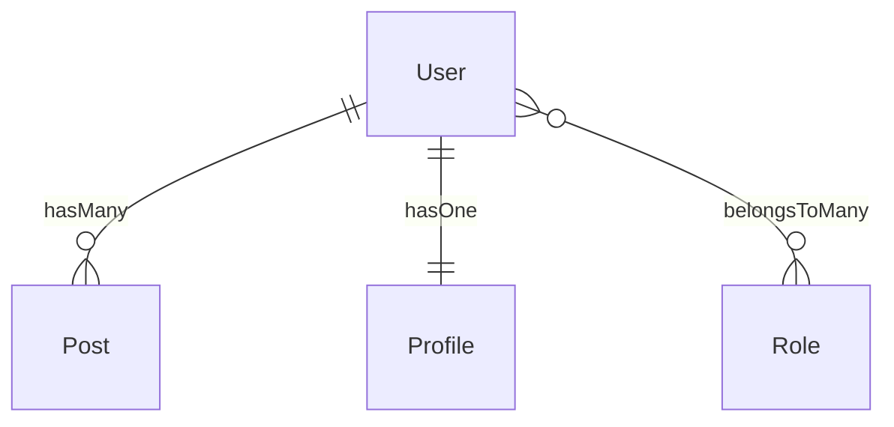

# Capyrel

**Schema intelligence for Laravel.** Describe your project in plain English, or point Capyrel at an existing database — it handles models, migrations, controllers, routes, API specs, tests, and more.

```bash
composer require julio/capyrel
```

> Laravel 11 & 12 · PHP 8.2+ · MySQL · PostgreSQL · SQLite · MongoDB

---

## Two modes

| Mode | When to use | Entry point |
|---|---|---|
| **New project** | Starting fresh, no database yet | `php artisan capyrel:new` |
| **Existing database** | DB already exists, need the boilerplate | `php artisan model:scaffold` |

---

## Quick start — new project

```bash
php artisan capyrel:new
```

```
  ██████╗ █████╗ ██████╗ ██╗   ██╗██████╗ ███████╗██╗
 ██╔════╝██╔══██╗██╔══██╗╚██╗ ██╔╝██╔══██╗██╔════╝██║
 ██║     ███████║██████╔╝ ╚████╔╝ ██████╔╝█████╗  ██║
 ...
  New Project Wizard — models + migrations, zero friction

  Laravel 12.x · PHP 8.3 · Scout

  Describe your project (or list your models):
  > a blog platform with posts, tags, authors, and comments

  Detected entities: Post, Tag, Author, Comment

  ── Post ────────────────────────────────────
  Archetype matched: post
  ┌─────────────┬──────────────────┬──────────────┐
  │ Field       │ Type             │ Flags        │
  ├─────────────┼──────────────────┼──────────────┤
  │ title       │ string           │ —            │
  │ slug        │ string           │ unique       │
  │ body        │ text             │ nullable     │
  │ published_at│ timestamp        │ nullable     │
  │ is_published│ boolean          │ default=false│
  │ user_id     │ foreignId → users│ —            │
  └─────────────┴──────────────────┴──────────────┘

  What would you like to do with Post?
  > Confirm — looks good
```

Capyrel writes:
- `app/Models/Post.php` — fillable, casts, relationships, traits
- `database/migrations/2026_05_24_000000_create_posts_table.php`

Then run:

```bash
php artisan migrate
php artisan model:scaffold   # controllers + routes
```

---

## Quick start — existing database

```bash
php artisan model:scaffold
```

```
  Detected relationships:

  User
  ├── hasMany          ──▶ Post          [posts.user_id]
  ├── hasOne           ──▶ Profile       [profiles.user_id]
  └── belongsToMany    ──▶ Role          [pivot: role_user]

  Post
  ├── belongsTo        ──▶ User          [posts.user_id]
  └── hasMany          ──▶ Comment       [comments.post_id]

  ⚕ Health check — 1 warning
  ⚠ [Post] Missing index on posts.user_id — full table scan risk
    ↳ Add: $table->index('user_id') in the migration

  Write relationship methods into model files? [yes]
  Generate / update controller files? [yes]
  Write resource routes to routes/web.php? [yes]

  ✔ Capyrel scaffold complete.
    4 model method(s) added · 2 controller(s) touched
```

---

## Project examples

### Blog platform

```bash
php artisan capyrel:new
# > a blog with posts, tags, categories, authors, and comments
# → Post, Tag, Category, Author, Comment

php artisan migrate
php artisan model:scaffold
php artisan model:resources    # API Resources with whenLoaded()
php artisan model:requests     # StorePostRequest, UpdatePostRequest
php artisan model:tests        # Pest relationship tests
php artisan capyrel:openapi    # OpenAPI 3.0 spec
```

Generated in ~30 seconds:
- 5 models with all relationships + casts
- 5 migrations
- 5 controllers with paginated `index()`, search, eager loading
- 5 API Resources (N+1-proof via `whenLoaded`)
- 10 Form Requests with column-derived validation rules
- Pest tests for every relationship
- Full OpenAPI spec ready for Postman/Swagger

---

### E-commerce store

```bash
php artisan capyrel:new
# > Product, Order, OrderItem, Customer, Review, Category, Coupon

# After review — each model gets archetype-matched fields:
# Product: name, slug, description, price:decimal, stock:integer, is_active:boolean
# Order:   reference, total:decimal, status, customer_id
# ...

php artisan migrate
php artisan model:scaffold
php artisan model:factory      # factories for all 7 models
php artisan model:seed         # seeder classes
php artisan capyrel:typescript # TypeScript interfaces for your frontend
php artisan capyrel:postman    # Postman collection with all routes
```

---

### SaaS with teams + subscriptions

```bash
php artisan capyrel:new
# > User, Team, TeamMember, Plan, Subscription, Invoice, Permission

php artisan migrate
php artisan model:scaffold

php artisan model:state-machine Subscription
# → Generates SubscriptionStateMachine: pending → active → cancelled → expired

php artisan model:permissions
# → Spatie permission matrix across Team, User, and all resources

php artisan model:broadcast User
# → Event + channel classes for real-time team notifications

php artisan capyrel:health-controller
# → /api/health endpoint with DB + cache checks
```

---

### REST API only

```bash
php artisan capyrel:new
# > Article, Author, Publication, Tag, Bookmark

php artisan migrate
php artisan model:scaffold --models --controllers --routes
php artisan model:resources    # API Resources
php artisan model:requests     # validation
php artisan capyrel:openapi    # docs
php artisan capyrel:typescript # types for frontend
php artisan capyrel:postman    # ready-to-import collection
```

---

## All commands

### New project wizard

```bash
php artisan capyrel:new              # interactive wizard
php artisan capyrel:new --force      # skip all confirmations
php artisan capyrel:new --skip-python  # use PHP-only entity parser
```

The wizard:
1. Detects your installed packages (Livewire, Scout, Sanctum, Spatie, Cashier, Filament)
2. Parses your description into entities using NLP (Python 3, stdlib only) or PHP heuristics
3. Matches each entity to an archetype (20+ archetypes: post, product, order, user, invoice…)
4. Shows proposed fields in an interactive table — add, remove, rename, toggle soft deletes
5. Loops: "Add another model?" until you're done
6. Writes models + migrations

---

### Existing database scaffolding

```bash
php artisan model:scaffold                    # full scaffold
php artisan model:scaffold User               # one model only
php artisan model:scaffold --models           # model relationship methods only
php artisan model:scaffold --controllers      # controllers only
php artisan model:scaffold --routes           # routes/web.php only
php artisan model:scaffold --dry-run          # preview, write nothing
php artisan model:scaffold --force            # skip confirmations
php artisan model:scaffold --connection=pgsql # specific connection
```

Writes to each **model**:
```php
public function posts(): HasMany
{
    return $this->hasMany(Post::class);  // capyrel: posts.user_id
}

public function roles(): BelongsToMany
{
    return $this->belongsToMany(Role::class);  // capyrel: pivot: role_user
}
```

Writes to each **controller**:
```php
public function index(Request $request)
{
    $users = User::with(['posts', 'profile', 'roles'])
        ->when($request->search, fn($q) => $q->where('name', 'like', "%{$request->search}%"))
        ->paginate(15);

    return view('users.index', compact('users'));
}
```

---

### Relationship map

```bash
php artisan model:map                        # ASCII tree
php artisan model:map --format=mermaid       # Mermaid diagram
php artisan model:map --format=both
php artisan model:map --save=docs/schema.md
```

```
User
├── hasMany          ──▶ Post
├── hasOne           ──▶ Profile
├── belongsToMany    ──▶ Role
└── hasManyThrough   ──▶ Comment  (via Post)
```



---

### API layer

```bash
# API Resources — N+1-proof via whenLoaded()
php artisan model:resources
php artisan model:resources User --force

# Form Requests — rules derived from column types + constraints
php artisan model:requests
php artisan model:requests Post
```

**`StorePostRequest.php`** (auto-generated):
```php
public function rules(): array
{
    return [
        'title'   => ['required', 'string', 'max:255'],
        'body'    => ['required', 'string'],
        'slug'    => ['required', 'string', Rule::unique('posts', 'slug')],
        'user_id' => ['required', 'integer', 'exists:users,id'],
    ];
}
```

Rule inference: `varchar(255)` → `max:255` · `nullable` → removes `required` · `*_id` FK → `exists:table,id` · unique index → `Rule::unique()` · column `email` → adds `email` rule · column `*_url` → adds `url` rule

---

### Tests

```bash
php artisan model:tests
php artisan model:tests User
php artisan model:tests --dry-run
```

**Generated Pest test:**
```php
describe('User relationships', function () {
    it('User::posts() returns a HasMany', function () {
        expect((new User)->posts())->toBeInstanceOf(HasMany::class);
    });

    it('User can attach Role', function () {
        $user = User::factory()->create();
        $role = Role::factory()->create();
        $user->roles()->attach($role->id);
        expect($user->fresh()->roles)->toHaveCount(1);
    })->skip('Remove skip() to enable DB test');
});
```

---

### Factories + Seeders

```bash
php artisan model:factory
php artisan model:factory Post
php artisan model:seed
```

Column-aware: `email` → `fake()->email()` · `*_at` → `fake()->dateTime()` · `boolean` → `fake()->boolean()` · `decimal` → `fake()->randomFloat(2, 1, 999)` · `*_id` FK → uses related factory

---

### Architecture layer

```bash
php artisan model:architecture Post
# → PostRepository, PostService, PostDto

php artisan model:state-machine Order
# → OrderStateMachine: pending → processing → shipped → delivered → cancelled

php artisan model:policy
# → PostPolicy with index/view/create/update/delete/restore

php artisan model:enum Post
# → StatusEnum, TypeEnum from string columns with known patterns
```

---

### Real-time + integrations

```bash
php artisan model:broadcast Post
# → PostCreated, PostUpdated, PostDeleted events + channels

php artisan model:notifications Post
# → PostNotification class with mail + database channels

php artisan model:livewire Post
# → PostIndex, PostForm Livewire components (requires livewire/livewire)

php artisan model:events Post
# → PostObserver + PostCreating / PostUpdated listeners
```

---

### Contract generation

```bash
php artisan capyrel:openapi     # OpenAPI 3.0 YAML spec
php artisan capyrel:typescript  # TypeScript interfaces
php artisan capyrel:postman     # Postman collection JSON
php artisan capyrel:graphql     # GraphQL schema SDL
```

---

### Safety + ops

```bash
# Migration safety scanner
php artisan capyrel:safe-migrate          # scan → confirm → run
php artisan capyrel:safe-migrate --check  # scan only, never runs

# Health check endpoint
php artisan capyrel:health-controller     # generates /api/health route + controller

# Webhook dispatcher
php artisan capyrel:webhooks              # generates WebhookDispatcher

# Permissions matrix (requires spatie/laravel-permission)
php artisan capyrel:permissions

# Watch mode — auto-updates models when migrations change
php artisan capyrel:watch
php artisan capyrel:watch --interval=3
```

---

### Utilities

```bash
php artisan model:optimize     # adds eager loading hints, query scopes, indexes
php artisan capyrel:audit      # full schema health report (without writing anything)
php artisan capyrel:clean      # removes generated boilerplate
php artisan capyrel:fullstack  # one command: scaffold + routes + tests
php artisan capyrel:stubs      # publishes all stubs for customisation
php artisan capyrel:demo       # generates a demo app schema for testing
```

---

## Health check

Every `model:scaffold` and `capyrel:audit` run checks your schema:

| Check | What it finds |
|---|---|
| N+1 risk | Relationship access without eager loading |
| Missing index | FK columns with no index — full table scan |
| Orphan FK | `*_id` columns pointing to tables that don't exist |
| Inverse missing | One-sided relationship — A→B defined, B→A not |
| Naming conflict | Generated method name clashes with existing method |
| Soft-delete drift | `deleted_at` column without `SoftDeletes` trait |
| Eager load depth | `hasManyThrough` chains 3+ levels deep |
| Circular dependency | Self-referential eager load that would loop |
| Cascade risk | FK with no `ON DELETE` rule |
| Dead relationship | Defined but never referenced anywhere |
| Fillable drift | `$fillable` fields that don't exist in the table |
| Morph registry | `morphTo` without `Relation::morphMap()` |

---

## Python NLP helper

`capyrel:new` optionally calls `python/capyrel_nlp.py` (bundled, stdlib only — no pip installs) for richer entity and field detection:

```bash
# What Python adds:
python3 vendor/.../capyrel/python/capyrel_nlp.py describe "a blog with posts and authors"
# → {"entities": ["Post", "Author"], "relations": [{"from": "Post", "to": "Author", "type": "belongsTo"}]}

python3 vendor/.../capyrel/python/capyrel_nlp.py fields Product
# → {"fields": ["name", "slug:string:unique", "description:text:null", "price:decimal", "stock:integer", "is_active:boolean"], "archetype": "product"}
```

Falls back to PHP heuristics automatically if Python 3 is not available, or pass `--no-python` to always use PHP.

---

## Database support

| Database | Schema reading | FK detection | Index detection |
|---|---|---|---|
| MySQL / MariaDB | ✓ | ✓ | ✓ |
| PostgreSQL | ✓ | ✓ | ✓ |
| SQLite | ✓ | ✓ | ✓ |
| MongoDB | ✓ (document sampling + migration fallback) | ✓ (convention) | ✓ |

---

## Configuration

```bash
php artisan vendor:publish --tag=capyrel-config
```

`config/capyrel.php` controls:

```php
'pagination' => ['per_page' => 15, 'type' => 'paginate'],

'features' => [
    'transaction_pivots' => true,  // wrap pivot syncs in DB::transaction()
    'json_responses'     => true,  // $request->wantsJson() dual responses
    'search'             => true,  // search block in index()
    'soft_deletes'       => true,  // restore/forceDelete methods
],

'spatie' => [
    'media_library'  => true,   // auto-detected from composer.json
    'permissions'    => true,
],
```

---

## Requirements

- PHP 8.2+
- Laravel 11.x or 12.x
- Python 3 *(optional — only for richer `capyrel:new` NLP; PHP fallback always available)*

---

## License

MIT
